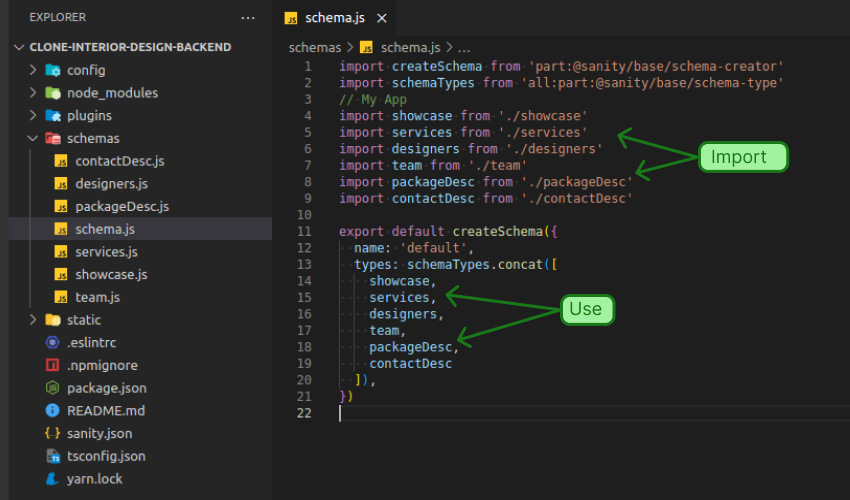

# Fluxo de Instalação/Uso do Sanity Studio (Sanity Studio v2)

## Etapa 1:
Você deve possuir uma instalação do CLI do Sanity em seu computador e uma conta criada na Plataforma deles. Caso não tenha, ou ainda se você não conhece o Sanity, veja nos links a seguir em como dar os primeiros passos, é super rápido e importante!
* [sanity](https://www.sanity.io/)
* [getting-started](https://www.sanity.io/docs/getting-started-with-sanity)
* [video tutorial (legendas)](https://www.youtube.com/watch?v=C51banxEeJE)

__NOTA__: Já está disponível o Sanity Studio v3. 
Veja como migrar: [Saiba como migrar o Sanity Studio de v2 para v3](https://www.sanity.io/docs/migrating-from-v2)

## Etapa 2:
Depois de instalado, crie um "Projeto Vazio", ou seja, sem a utilização de algum template como referência. Concluído o processo de instalação do seu projeto, dê início a ele e faça o login com os dados que você utilizou na criação de sua conta na [__Etapa 1__](#etapa-1).

__NOTA:__ Perceba que será executado localmente, uma aplicação web rodando na `porta 3333`. Quando você acessar esse endereço, será exigido o login de acesso. Essa aplicação é o Sanity Studio!

## Etapa 3:
Na estrutura de pastas do projeto criado, procure pela pasta `schemas`. Nela, cole todos os arquivos `.js` que estão na pasta de mesmo nome (`schemas`) neste repositório.
Perceba que na pasta `schemas` do projeto criado, existe um arquivo com o nome `schema.js`. Nele, faça a importação de todos os arquivos que você colou em seguida utilize-os. Veja na imagem como proceder:

## Etapa 4:
Volte para o Studio e preencha o conteúdo de todos os campos.

__NOTA:__ Você pode usar as imagens disponíveis na pasta `img` deste repositório.

## Conclusão
Agora você tem uma base de dados remota e gerenciável para utilizar em seu site.

# Sanity Studio Installation and Use Manual (Sanity Studio v2)

## Step 1
You must have a Sanity CLI installation on your computer and an account created on their Platform. If you don't, or if you don't know Sanity yet, check the links below on how to take the first steps, it's very quick and important!
* [sanity](https://www.sanity.io/)
* [getting-started](https://www.sanity.io/docs/getting-started-with-sanity)
* [video tutorial (subtitles)](https://www.youtube.com/watch?v=C51banxEeJE)

NOTE: Sanity Studio v3 is now available. 
See how to migrate: [Learn how to migrate Sanity Studio from v2 to v3](https://www.sanity.io/docs/migrating-from-v2)

## Step 2
Once installed, create an "Empty Project", i.e. without any template to reference. When you are done installing your project, start it, and log in with the data you used to create your account in [__Step 1__](#step-1).

__NOTE:__ Note that a local web application will be running on `port 3333`. When you access this address, you will need to login. This application is Sanity Studio!

## Step 3
In the project folder structure that you have created, look for the folder named `schemas`. There, paste all the `.js` files that are in the folder of the same name (`schemas`) into this repository. Notice that in the `schemas` folder of the project you created, there is a file called `schema.js`. In it, import all the files you pasted and then use them. See the image for how to proceed:

## Step 4
Go back to Studio and fill in all the fields.

__NOTE:__ You can use the images available in the `img` folder in this repository.

## Conclusion
Now you have a remote, manageable database to use for your website.
