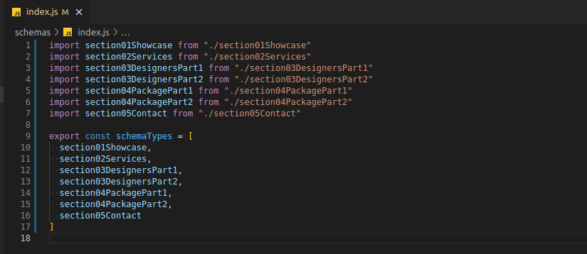

# Fluxo de Instalação/Uso do Sanity Studio (Sanity Studio v3)

## Etapa 1:
Se você não conhece o Sanity, crie uma conta e faça o tutorial inicial, veja os links a seguir:
* [sanity](https://www.sanity.io/)
* [getting-started](https://www.sanity.io/docs/getting-started-with-sanity)

## Etapa 2:
Depois de ter criado uma conta e ter feito o primeiro tutorial, crie um "Projeto Vazio", ou seja, sem a utilização de algum template como referência. Concluído o processo de instalação do seu projeto, dê início a ele e faça o login com os dados que você utilizou na criação de sua conta na [__Etapa 1__](#etapa-1).

__NOTA:__ Perceba que será executado localmente, uma aplicação web rodando na `porta 3333`. Quando você acessar esse endereço, será exigido o login de acesso. Essa aplicação é o Sanity Studio!

## Etapa 3:
Na estrutura de pastas do projeto recém criado procure pela pasta `schemas`, e nela cole todos os arquivos da pasta `schemas` deste repositório de apoio. Em seguida faça a importação desses arquivos no `index.js` do seu projeto Sanity. Veja a imagem:

## Etapa 4:
Volte para o Studio e preencha o conteúdo de todos os campos.

__NOTA:__ Você pode usar as imagens disponíveis na pasta `img` deste repositório.

## Conclusão
Agora você tem uma base de dados remota e gerenciável para utilizar em seu site, clique no link a seguir para configurar o Front-end com a Api do Sanity:
  * [__Front-end Setup__](https://github.com/vini-cabral/clone-interior-design#etapa-2---vari%C3%A1veis-de-ambiente)

# Sanity Studio Installation and Use Manual (Sanity Studio v2)

## Step 1
If you don't know Sanity, create an account and study the initial tutorial, see the following links:
* [sanity](https://www.sanity.io/)
* [getting-started](https://www.sanity.io/docs/getting-started-with-sanity)

## Step 2
After you have created an account and done the first tutorial, create an "Empty Project", i.e. without using any template for reference. Once you have completed the installation process of your project, start it and log in with the data you used to create your account in [__Step 1__](#step-1).

__NOTE:__ Note that it will run locally on `port 3333`. When you access this address, you will be required to login. This application is Sanity Studio!

## Step 3
In the folder structure of the newly created project look for the `schemas` folder, and paste all the files from the `schemas` folder of this support repository into it. Then import these files into the `index.js` of your Sanity project. See the image:

## Step 4
Go back to Studio and fill in all the fields.

__NOTE:__ You can use the images available in the `img` folder in this repository.

## Conclusion
Now you have a remote, manageable database to use for your website, click on the following link to set up the Front-end with Sanity's Api:
  * [__Front-end Setup__](https://github.com/vini-cabral/clone-interior-design#step-2---environment-variables)
